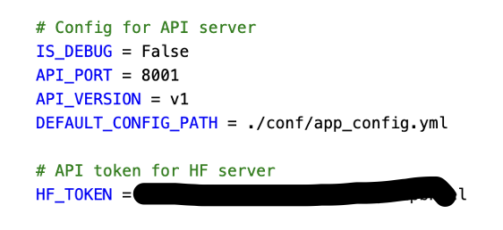
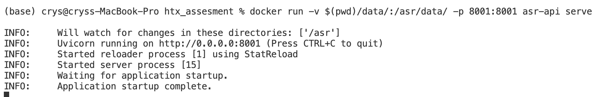
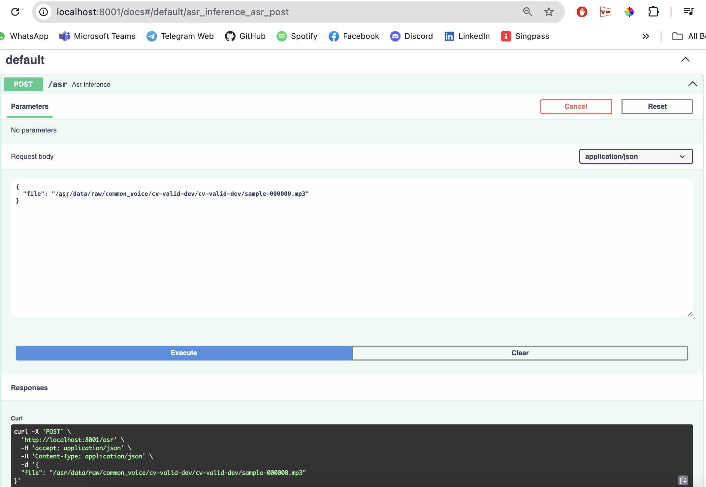
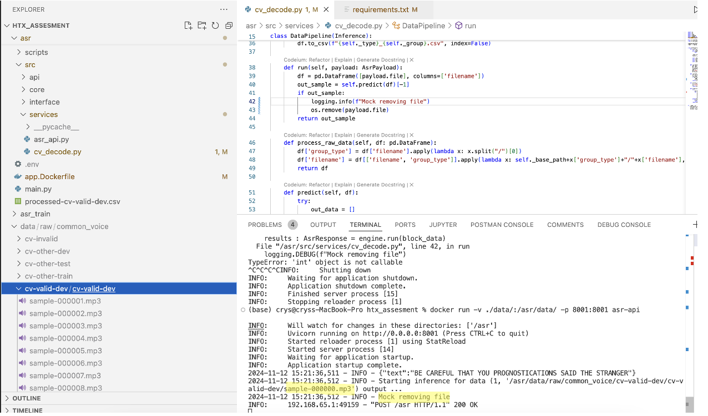

# ASR Application Setup Guide

This README provides instructions to set up the environment and run inference using Docker. Follow these steps to get your system ready and execute the inference tasks.

## 1. **Environment Setup**

### 1.1 Prerequisites
- **Docker**: Make sure Docker is installed on your system. If you don't have Docker installed, follow the instructions based on your operating system:
  - [Install Docker on Windows](https://docs.docker.com/docker-for-windows/install/)
  - [Install Docker on macOS](https://docs.docker.com/docker-for-mac/install/)
  - [Install Docker on Linux](https://docs.docker.com/install/linux/docker-ce/ubuntu/)

- **Git**: Ensure Git is installed for cloning the repository.
  - [Install Git](https://git-scm.com/book/en/v2/Getting-Started-Installing-Git)

### 1.2 Clone the Repository

To get started, first clone the repository containing the project files to your local machine.

```bash
git clone https://github.com/crystaltys/htx_assesment.git
cd htx_assesment/
```
### 1.3 Build the Docker Image
Navigate to the project directory (where your Dockerfile is located) and build the Docker image. This will set up the required environment for running the inference:

```bash
docker build -t asr-api -f asr/app.Dockerfile .
```


### 1.4 Load .env File
Add .env file to ./asr directory.



## 2. **Running Inference with Docker**
Once the environment is set up and the image is built, you can start the container to run inference. There is a volume mount when running the docker container as the requirement requires the file to be deleted once processed. 

### 2.1 Run the Docker Container
To run the Docker container with the inference setup, use the following command:

```bash
docker run -v $(pwd)/data/:/asr/data/ -p 8001:8001 asr-api serve
```


### 2.2 Run Predictions using FastAPI Interactive Server
To obtain the prediction results, use the following command access http://0.0.0.0:8001/docs. Add the mounted volume of "/asr/data" + "/path/to/file".



### 2.3 Remove File and Get Predictions




